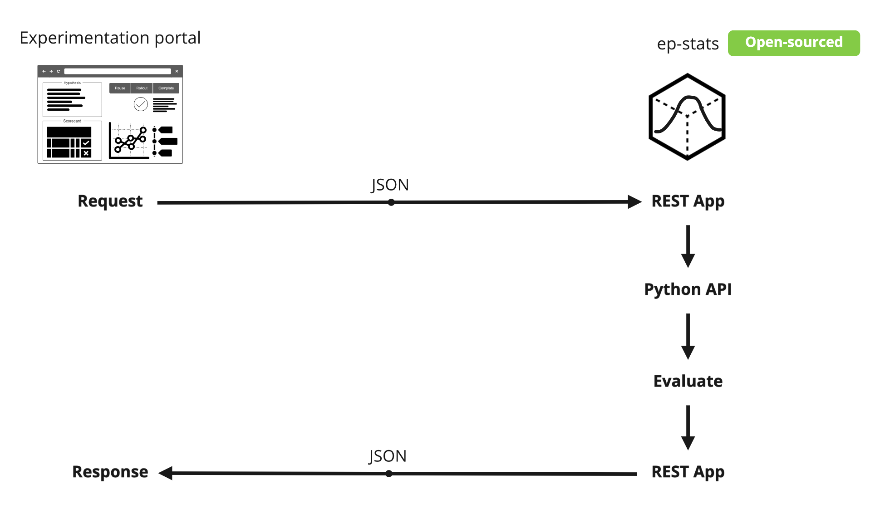
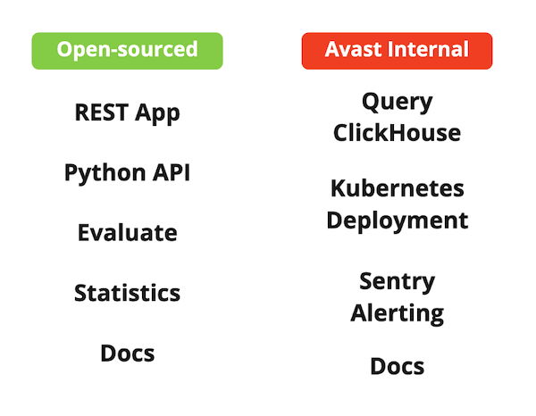
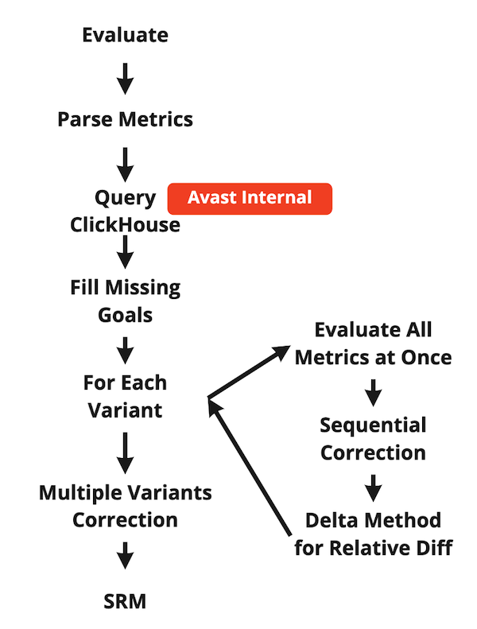
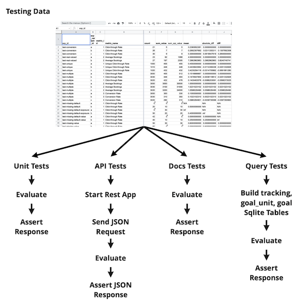

# Architecture

Ep-Stats provides package and REST app that can be used in any experimentation portal. We do following main abstractions to allow this.

## Experimentation Portal

While we built Experimentation Portal in Avast, we are far from being able to open source it because it contains too much of Avast proprietary information. We abstracted this by having json rest API part of Ep-Stats. Json request contains definition of experiment metrics to evaluate which is later translated into implementation-specific query to retrieve goals aggregated per variant.

## Data and Goals

Event data, goals, metrics, database, storage, access those are all implementation-specific and heavily proprietary. Ep-Stats does not require any particular database or data format. Ep-Stats provides abstract experiment definition including definitions of goals required for experiment evaluation. It is left to implementors to transform this abstract experiment definition to SQL queries, Spark queries, or anything that has been in place. It is also left to implementators if they support all Ep-Stats features in these queries e.g. filtering results by domains, having goals with parameters, etc.

Ep-Stats only requires goals aggregated per variant in [`Experiment.evaluate_agg`][epstats.toolkit.experiment.Experiment.evaluate_agg] method input. See [this example](./user_guide/aggregation.md#example) for details.

Ep-Stats abstracts access to date using proprietary implementations of [`Dao`](./api/dao.md) and [`DaoFactory`](./api/dao_factory.md) classes that are passed via dependency injection into the rest app.

## Open vs. Proprietary

We are using [ClickHouse](https://clickhouse.tech) database in Avast to store experiment data. We also deploy Ep-Stats into [Kubernetes](https://kubernetes.io) and we use [Sentry](https://sentry.io) for alerts. This is all proprietary and left to implementors of this project to do by their own means and standards.

## Program Flow

Program flow is simple and linear. There is a cycle for each variant that compares all variant metrics against values in the control variant in one vectorized step making the numpy code little harder to follow, but speeding up evaluation of experiments with many metrics significantly.

## Testing

We prepared many artificial testing data we use in different kinds of unit tests. Testing data contains experiment metric evaluation including complete statistical output done manually in Excel. We use this to assert evaluation results computed by Ep-Stats against.

See [Test Data](./user_guide/test_data.md) for details. We unit test on following levels:

1. Simulating experiment evaluation from Python [`Experiment`](./api/experiment.md) API.
1. Evaluating experiments as called via json rest API.
1. Unit testing all Python code snippets in docstrings ensuring code examples works.
1. In Avast proprietary implementation, we also simulated ClickHouse experiment data using SQLite database to be able to unit test our proprietary translation from experiment definition into SQL code.

## CI/CD

Development workflow is started with simple `make install-dev` call that sets development environment up. We develop Ep-Stats agains unit tests. Rest app could also be launched locally. We employ pre-commit hooks to fix and check our Python code style.

CI/CD is done using GitHub actions where we run all unit tests, deploy documentation, and release to PyPI.

