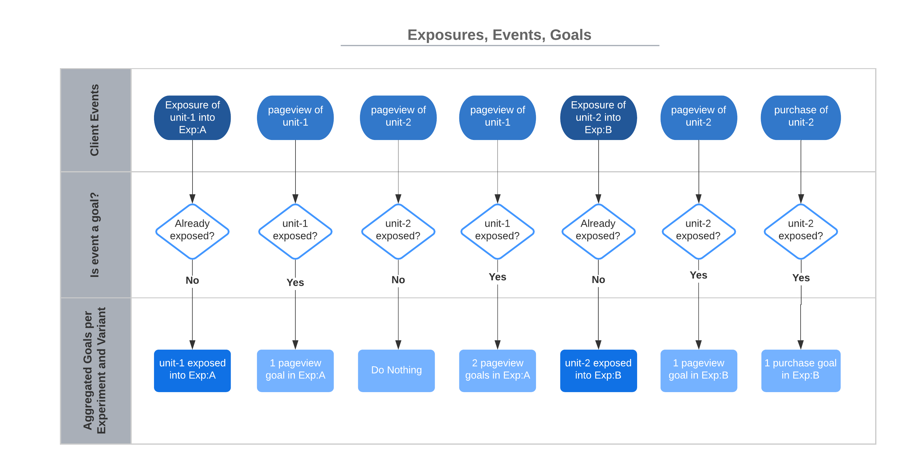

# Basic Principles

We describe basic principles of online controlled experiments and a way how we implement them as events, goals, metrics, and exposures. This section also gives some implementation advice how to effectively
set telemetry in the app to collect events.

## Online Controlled Experiments

When executed properly, online controlled experiments (OCE) are a way to establish
causal relationship between some introduced change (in treatment variant) and its
impact on some metric of interest.

OCEs randomly distribute *Randomization Units* (RU) (e.g. users) into multiple groups called variants. Randomization units are also known as experimental units or observations in experimentation literature. We will be using simple term *unit* to refer to randomization unit in this documentation.
We compare the *Control variant* where there is no treatment or change present with one or more *Treatment variant(s)* where there is treatment or change present. We are interested in which variant is performing how compared to the control variant. Units' interactions are recorded during the period of the experiment and later analyzed statistically during the experiment and at the end of it. We are
interested in:

1. Determining the presence of a difference in one or more metrics between the control and treatment variants
2. Determining the size of the difference
3. Determining if we can reason that measured difference was caused by the tested change or by
pure chance
4. If we are confident (up to some level) that the measured difference was caused by
the tested change we consider the diff to be *Statistically Significant* (with some confidence level).

Source: [Ron Kohavi, Trustworthy Online Controlled Experiments: A Practical Guide to A/B Testing](https://www.amazon.com/Trustworthy-Online-Controlled-Experiments-Practical/dp/1108724264).

> Colloquially put, to evaluate some **metric** in the experiment, we need a way how to calculate the metric
from **goals** that we collect in form of **events** from units **exposed** to the experiment.

We will continue by describing these terms and explaining how they play together.

## Exposures

We distribute units randomly (independently and identically – IID[^1]) into experiment variants. We can imagine that we *assign* units to some experiment and variant. We say that the unit (e.g. user, license, ...) has been *exposed* to the experiment E and variant V at the moment when the unit experienced the control or treatment variants.

For example, we expose the unit to the green variant of some experiment when the unit sees the green screen. Or we expose some other unit to the yellow variant of the same experiment when the unit sees the yellow screen.

> The concept of explicit exposure is crucial in ep-stats. It decouples assignment of the unit into some experiment and variant from rather explicit exposure. The assignment has no impact on the unit's customer experience, it is merely just a technical thing. While the moment of exposure has direct impact on the unit's customer experience because the unit sees a green or yellow screen.

The following graph illustrates the importance of the exposure event. It is the moment we start recording events attributed with the exposed unit (`unit-1` and later `unit-2` in this case) per experiment and variant.

By making the exposure explicit, we later limit our analysis only to those units that experienced the change in the experiment. This drastically improves sensitivity of the analysis (we are able to detect smaller differences or the same diffs but with lower unit count).

Since we know the explicit moment of exposure, we do not need to add any artificial test information to events we collect from products. We simply start recording all events from all units that have already been exposed to experiment E and its variant V. One unit can certainly be exposed into an arbitrary number of experiments at the same time. We record all events from such unit and attribute them to all experiments and variants the unit has been exposed to.

## Events and Goals

After the unit has been exposed to the experiment (control or treatment variant), we are interested in unit's events such as clicks, conversions etc. These events are called *events* in ep-stats. ep-stats listens to the stream of these events coming from units and we attribute (record) events of interest as *goals* to some experiment E and variant V if that event happened on some unit that has been exposed to the experiment E and variant V before. ep-stats uses goals to compute all metrics.

The exposure is a (special) goal in the ep-stats as well.

### Goal Attribution

We attribute goals to experiments and variants based on units exposures. This means that every event that should make a goal in ep-stats must reference some unit. Without that, ep-stats is not able to recognize what exposure to look up to determine which experiment(s) and variant(s) the goal should be attributed to.

See [Supported Unit Types](user_guide/aggregation.md#supported_unit_types).

## Metrics

We calculate *metrics* from goals. We calculate metrics per experiment variant. Metrics are usually some average number (or value, e.g., value of conversion in USD) of positive goals over number of exposures. For example, the metric *Average Bookings* is defined as USD value of all conversions of all users exposed to the experiment divided by number of users exposed to the experiment.

We define metrics from goals in form of *nominator* and *denominator*. For example, we define metric *Average Bookings* as `value(test_unit_type.unit.conversion) / count(test_unit_type.global.exposure)` where

* `value` determines we need the value of goals recorded, e.g., USD bookings in this case (`count` then means number of `conversion` goals)
* `test_unit_type` is a type of unit
* `unit`, `global` are types of aggregation
* `conversion`, `exposure` are goals

See [Aggregation](user_guide/aggregation.md) for details about how we process data and about specifics of metric definitions in ep-stats.

### Some Potential Caveats

While ep-stats handles most of the known problems transparently for the experimenter, it is important to be mindful at least about the following potential problems.

1. Due to randomization of units, every metric is a random variable. ep-stats helps to provide "always valid" metric values and statistics to allow you to "always make a good decision". This relates to a problem of "peeking at results" which we solve using [sequential analysis](stats/sequential.md).
1. In some metrics, a unit is not the same as analysis unit. This violates IID assumption and requires ep-stats to perform [delta method](stats/ctr.md#asymptotic-distribution-of-ctr).

We describe these problems in detail in [Statistics](stats/basics.md).

[^1]: [Independent and identically distributed random variables - IID](https://en.wikipedia.org/wiki/Independent_and_identically_distributed_random_variables)
