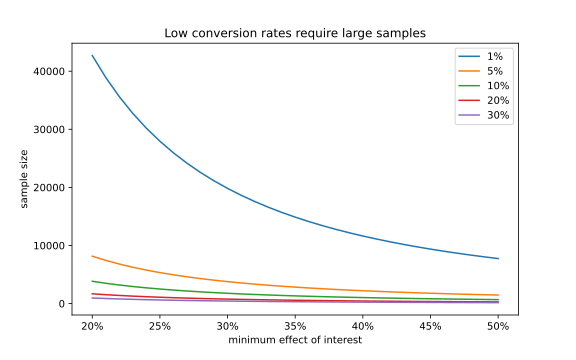
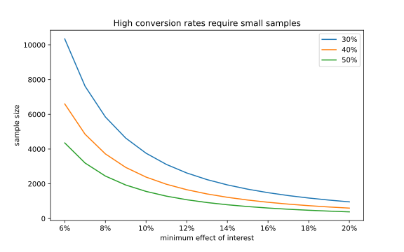

# Sample Size

Setting a correct sample size is a key step when launching successful experiments.
This page discuss how to calculate it and how to proceed if the required sample is too large.

There is no free lunch in experimenting. Every experiment owner needs to navigate the trade-off between
the selected metric, sample size, and ability to detect an impact of certain size.

## Why You Should Know the Correct Sample Size

When your sample size is too small, your metrics will be noisy and you will not be able to replicate
the experiment. You will be at increased risk of encountering two types of errors:

- Failure to detect an existing effect
- Measured effect is greater than in reality

## What Impacts the Sample Size

Sample size depends on the mean and variance of the selected metric and on the *minimum effect of interest* (MEI).
MEI is the smallest relative difference between the control and treatment that is meaningful for the experiment
owner to detect.

While it can be insightful to run an experiment that is able to detect +1% difference as statistically significant,
it does not always make sense to full-scale such an experiment. In many bussiness cases, the effect of +1% is just too
small to offset the cost of a full-scale rollout.

Compromising on the size of the effect we can measure by using higher MEI helps us limit the number of users we need
to expose to an experiment. Smaller sample of users means smaller negative impact in case of an experiment going wrong.

> MEI is the smallest relative difference between the control and treatment that is meaningful for the experiment
owner to detect.

## Calculating the Sample Size

Sample size per variant $n$ can be computed as

$$
n = \frac{(Z_{1-\alpha/2} + Z_{1-\beta})^2(\sigma_1^2 + \sigma_2^2)}{\Delta^2}
$$

- $\sigma_1$, $\sigma_2$ are the standard deviations of the control and treatment respectively.
- $\Delta = |\mu_2 - \mu_1| = \mu_1\mathrm{MEI}$ is the difference between the control and treatment mean.
- $Z_{x} = \Phi^{-1}(x)$ where $\Phi^{-1}$ is the inverse CDF of the standard normal distribution $\mathcal{N}(0, 1)$.
- $\alpha$ is the false positive rate, $1-\frac{\alpha}{2}$ is the confidence level of a two-sided test.
- $\beta$ is the false negative rate, $1 - \beta$ is the power.

When the treatment standard deviation is unknown, we assume $\sigma_1 = \sigma_2$. This gives us a simplified
formula for power $1 - \beta = 0.8$ and $\alpha = 0.05$.

$$
n \approx \frac{(Z_{0.975} + Z_{0.8})^2 2\sigma_1^2}{\Delta^2} \approx \frac{15.7\sigma_1^2}{\Delta^2}
$$

In case of conversion metrics such as CTR (click-through rate) that follow Bernoulli distribution,
the treatment standard deviation is known because $\sigma^2 = p(1-p)$ where $p=\mu$ is the conversion rate.

$$
\mu_2 = \mu_1(1 + \mathrm{MEI}) \\
\sigma^2_2 = p_2(1-p_2) = \mu_2(1-\mu_2)
$$

We can see that:

1. Sample size increases as MEI decreases (because $\Delta$ is in the denominator).
1. Conversion rates $p = 0.5$ result in the largest required sample size (because of large $\sigma^2$).

### Low Conversion Rate

The baseline rate of sales metrics such as conversions per view is usually below 1%. Low baseline metrics require
large sample sizes to measure an experiment impact.

The following figure shows how the required experiment size varies depending on the metric baseline.
For example, we would need over 20,000 samples per variant to measure an impact of 20% when using a metric
with 1% baseline conversion.

### High Conversion Rate

CTR and other engagement metrics with higher baseline rates usually requires smaller experiment sizes.

A metric with a baseline of 50%, needs less than 1000 samples to measure 20% impact. Why?
Because when the MEI stays constant, high baseline $\mu_1$ translates to a large absolute difference
$\Delta = \mu_1\mathrm{MEI}$.

## Required Sample Size Is Too Large

Let's say we want to run an experiment that introduces a new feature to our product. While the ultimate goal
is to increase subscription sales, metrics such as bookings per user might not be the right choice because
of their low baseline requiring unreasonable large experiment sizes.

One of the ways around this problem is to use a high baseline **proxy metric** (for example number
of feature enagements) that is able to reflect the business impact of the new feature while needing
significantly smaller samples.
