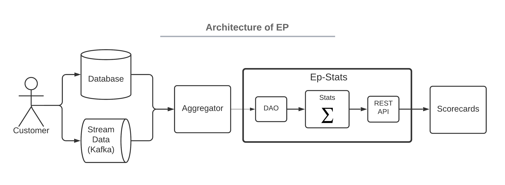

# Ep-Stats

**Statistical package for experimentation platform.**

It provides a general python package and REST API that can be used to evaluate any metric
in AB test experiment.

## Features

* Robust two-tailed t-test implementation with multiple p-value corrections and delta-methods applied.
* Sequential evaluations allowing to stop experiments early.
* Connect it to any data source to either get pre-aggregated or per randomization unit data.
* Simple expression language to define arbitrary metrics.
* REST API to integrate it as a service in experimentation portal with score cards.

We encourage all readers to get familiar with basic EP [Principles](principles.md) and then follow
[Quick Start](user_guide/quick_start.md).

## Architecture

In regular experimentation platform, client data and telemetry have to pass through several components before experimenters can see results in metrics in scorecards. Ep-stats solves the statistical part of the pipeline as is described on following image.

Client data and telemetry collection are specific to the company, we do not strive to provide any support for this part. *Aggregator* is optional part between raw data and ep-stats that can help to unify and pre-aggregate data consumed by ep-stats. *Scorecards* represent user interface in some kind of experimentation portal or knowledge base that lists experiments and displays scorecards with experiment results and statistics.

Ep-stats offers following components:

1. DAO (data access object) interfacing underlying data source with a way how to compile required metric data into SQL or anything else in use.
1. Stats computing experiment evaluation with statistics.
1. REST API a web app that makes it easy to integrate experiment evaluations in scorecards.

## Known Limitations and Suggestion for Future Work

Field of online experimentation is developing as well as data, metrics, methods, statistics. We strive to provide correct experiment evaluation. Its development takes time.

Current main and known limitations.

1. Metrics that are not based on (randomization) unit type (e.g. Views per User if session is our unit type) require application of
delta method and bootstrapping[^1]. This is not implemented yet.
1. Drill-down into dimensions is not implemented yet.
1. Experiment data are aggregated as whole, cumulative evaluation or data for timeline graphs are not yet implemented.

## Origin

Ep-stats originated as a part of experimentation platform implementation in [Avast](https://www.avast.com).
While there are many books on experimentation and statistics, there are few or none good implementations of it. We aim to fill in this gap between theory and practice by open-sourcing ep-stats package.

We have been using EP with this implementation of ep-stats to run and evaluate hundreds of experiments in Avast. We will be adding new stuff here as we improve it and test it in Avast.

## Inspiration

Software engineering practices of this package have been heavily inspired by marvelous [calmcode.io](https://calmcode.io/) site managed by [Vincent D. Warmerdam](https://github.com/koaning).

[^1]: [A. Deng et al., Applying the Delta Method in Metrics Analytics: A Practical Guide with Novel Ideas](https://arxiv.org/pdf/1803.06336.pdf)
