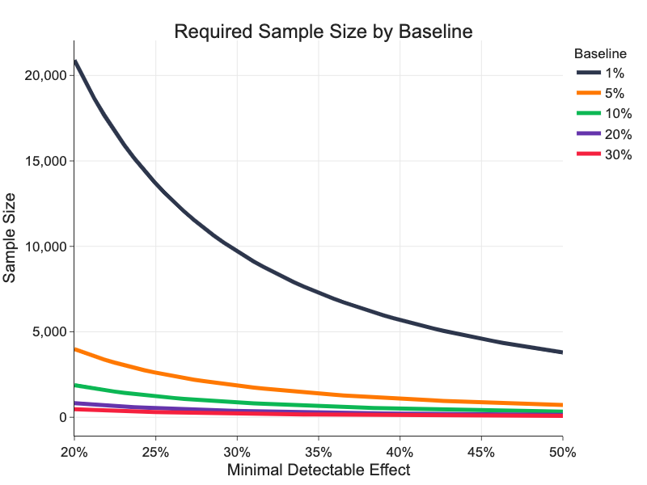
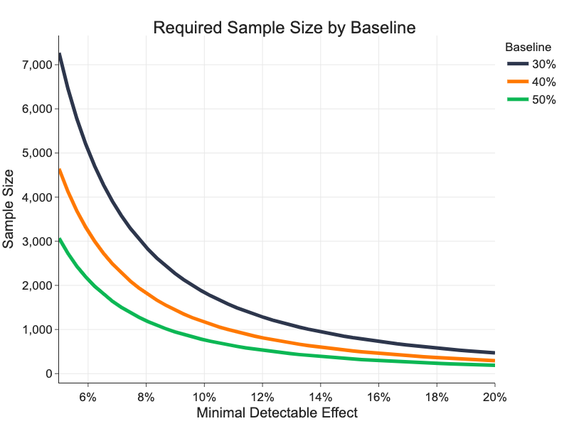

# Sample Size

Setting a correct sample size is a key step in launching successful experiments. We discuss what has an effect
on required experiment sample size, how to calculate it and how to proceed if required sample size is too big.

There is no free lunch in experimenting, everyone doing experiments navigates between trade-offs of significance, baseline metric conversion rate, measured differences and sample size.

## What Impacts Sample Size

Sample size depends on selected primary metric, on its baseline conversion rate and on a size of *minimal detectable effect (MDE)*. MDE is a minimal relative difference in primary metric between treatment and control variant, which we are willing to detect, i.e. which will be statistically significant.

One way how to look at MDE is as experimenters estimate size of the impact the change in the experiment will have. But there's more practical view of MDE.

While it is always good to run an experiment that detects +1% change as statistically significant, it does not make always sense to full-scale such experiment. The change of +1% is simply too small so it does not have business impact offsetting the cost of full-scaled solution. Moreover to detect small change such as +1%, you need to have a great amount of users in the experiment.

Let assume we full-scale the experiment if the effect on primary metric is at least +5% . Then +5% is our MDE. Detecting +5% effect as statistically significant requires much less users than detecting +1% change. This gives us also a way how to estimate MDEs in different experiments.

> MDE is a minimal change the experimenter wants to measure in the experiment to make it reasonable to full-scale.

### Small Baseline

Sales metrics like Conversions per Pageview or Conversions per User have usually baseline conversion rates below 1%. This requires to use big sample sizes to measure significant results.

Following graph shows how sample size depends on various smaller baseline conversion rates and MDE. We can see
that we need over 20,000 samples per variant to measure significant difference of 20% on a metric with 1% baseline conversion rate.

### Bigger Baseline

Engagement metrics like Click-through Rate (CTR) or [proxy metrics](sample_size.md#proxy-metrics) usually have much higher rates than sales metrics making it easier to measure significant differences.

We can see that we need only 3,000 samples per variant to detect a difference of 5% as statistically significant on a metric with 50% baseline conversion rate.

## Calculating Sample Size

We can calculate sample size $n$ per variant as:

$$n = \frac{(z_{\alpha/2})^2\left[\hat{p}_A(1-\hat{p}_A) + \hat{p}_B(1-\hat{p}_B)\right]}{\Delta^2}$$

where $z_{\alpha/2}$ is a critical value of normal distribution for confidence level $\alpha$, $\hat{p}_A$ is baseline conversion rate in variant A, $\hat{p}_B$ is expected or estimated conversion rate in variant B and $\Delta = \hat{p}_B - \hat{p}_A$ is minimal detectable effect (MDE).

!!! note
    For conversion rates, sample variance $\hat{\sigma}^2 = \hat{p}(1-\hat{p})/n$.

As we discussed in previous chapter, we can see that:

1. Sample size increases as MDE decreases (because $\Delta$ is in the denominator).
1. Sample size is greatest for conversion rates equal to 0.5.

## What to Do If Sample Size is Too Big

We saw that required sample size is

1. Proportional to $\hat{\sigma}^2/\Delta^2$.
1. Many key metrics have high-variance (eg. Conversions per User, Revenue per Mile (RPM), ...
1. The problem:
    1. As we optimize, we need to measure smaller and smaller differences.
    1. We need 100K users per variant to detect 2% change to RPM.
    1. We need 40M users to detect 0.1% change to RPM

What can we do when required sample size is too big to run reasonable experiment?

### Proxy Metrics

> Is there anything else in users' interactions that tells us what variant they like more?

1. Do users click more?
1. Do users return more often?
1. Do users return quicker?
1. How long do users spend on our website?
1. How long do users spend on the particular page?

We can measure proxy metrics for every exposure of every user and every session, engagement metrics have much higher baseline conversion rates thus require much smaller sample sizes. Engagement metrics usually correlate with sales metrics e.g. who clicks also buys etc.

To show 10% improvement on 50% baseline we need 764 samples!

There are not many engagement metrics[^1] available in EP at the moment, we would like to add some from the following list. At the moment, please, take it as an inspiration of what will be possible in the future.

|Metric                         |Experimentation Unit |Description      |
|:------------------------------|:--------------------|:----------------|
|**User metrics**|||
|Sessions per User | User ||
|Clicks per User| User | Clicks on any element on the website, user-level CTR. |
||||
|**Duration metrics**|||
|Duration of a Session| Session ||
|Sessions Duration per User| User ||
|Duration of an Absence   | Absence-2 | |
|Duration of an Absence per User| User-2 | If user had at least 2 sessions |
|Time on Page   | Pageview | On experiment screen |
|Time to Click   | Pageview  | On experiment screen or experiment element only  |
||||
|**Action metrics**|||
|CTR   | Pageview | On experiment screen or experiment element only  |
||||
|**Metrics with too low conversion rate**|||
|Downloads | Pageview| |
|RPM   | Pageview | On experiment screen or experiment element only  |
|CNV   | Pageview | On experiment screen or experiment element only  |
|Downloads per User| User ||
|Transactions per User| User ||

[^1]: [Yandex, Practical Aspects of Sensitivity in Online Experimentation with User Engagement Metrics](https://research.yandex.com/publications/99)
