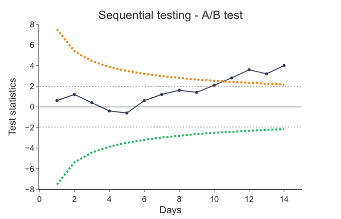
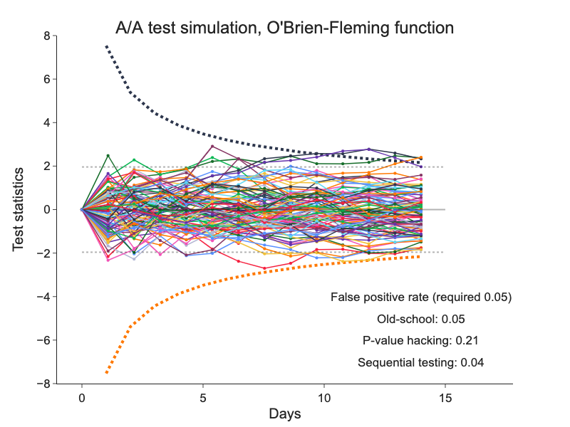

# Sequential Evaluation

There is a strong demand from experimenters to statisticians for support of online decision making in online controlled experiments (OCE). Given big volume of observations and real-time nature of modern data pipelines, this demand is validated.

This brings new issues to statistical evaluations. We cannot use standard Student’s t-test, because it assumes that we evaluate data only once - after all experiment data has been collected.

It has been known for a while, that evaluating experiments sequentially using standard t-tests increases dramatically type I errors (False-positive errors) that platforms try to keep below desired 5%. Using standard t-tests sequentially increases false-positive errors to a range of 20-30% or even higher making whole statistical inference useless.

We verified this statement using simulations of A/A tests.

We can evaluate experiments sequentially without exceeding desired false-positive errors using more sophisticated methods. Unfortunately, there is no unique approach how to deal with this problem. Multiple approaches differs mainly in mathematical complexity. Therefore we present a very basic one, so-called *Alpha Spending Function*[^1]. Despite its simplicity, it had been used in clinical trials for decades, so we have a good reason to use it too.

## Peeking at Temporary Results is Wrong

We can say that any A/A experiment when ran long enough will show significant difference in the primary metric regardless of the validity of the null hypothesis. So there's 100% chance that we get false-positive result if we are not careful about this fact. We want to keep this error below 5% any-time. This is not possible without setting experiment duration before starting it. Knowing where we are in the period of experiment helps EP to provide results with controlled false-positive error rate any time.

Following graph illustrates this problem. Test statistic measures difference in value of treatment variant metric to the value of control variant on unit scale. If we call the experiment off once the value of the test statistics crosses one of two constant boundaries (dashed lines) for the first time at day 6, we might be doing false-positive error compared to if we evaluated the experiment once completed at day 14.

## Alpha Spending Function

EP allows for safe early-stopping when observed difference is big enough. It requires the difference to be bigger early in the experiment than at the end of the experiment. Intuition is that if the experiment is doing really great or really poor, we do not need to wait full experiment duration to make a decision.

Following graph shows decreasing decision boundary that requires observed difference to be big at the beginning of the experiment and decreases along the time. The decision boundary is called *Alpha Spending Function* and we implemented O'Brien-Fleming[^2] version of it.

This process ensures below 5% false-positive errors at any time during the experiment but requires setting experiment duration upfront to be able to calculate decreasing boundaries. This requirement is covered in implementation of the [experiment protocol](../user_guide/protocol.md).

## Simulation

We simulate 2000 A/A experiments for Click-through rate metric. We want to compare three possible solutions to sequential evaluation:

1. Old-school - we evaluate the experiment once and after all data has been collected.
1. p-Value hacking or peeking - we evaluate the experiment once a day during whole experiment duration using constant decision boundaries.
1. Sequential experimenting - we use alpha spending function and evaluate once a day during whole experiment duration.

We measure the quality of the solution by false-positive error rate.

Following chart depicts development of A/A experiments in 14 days. We see that old-school and sequential experimenting methods keep false-positives below 5% while p-value hacking method shows false-positive errors around 20%.

The longer we run the experiment the greater false-positive error rate we can expect. It can even be 29% for 30-day experiment.

We can conclude that sequential experimenting is the best method for our needs and simple enough to implement.

[^1]: [David L. DeMents, K. K. Gordon Lan, Interim analysis: The alpha spending function approach](https://eclass.uoa.gr/modules/document/file.php/MATH301/PracticalSession3/LanDeMets.pdf)
[^2]: [P. C. O’Brien, T.R. Fleming - A Multiple Testing Procedure for Clinical Trials](https://doi.org/10.2307%2F2530245)
