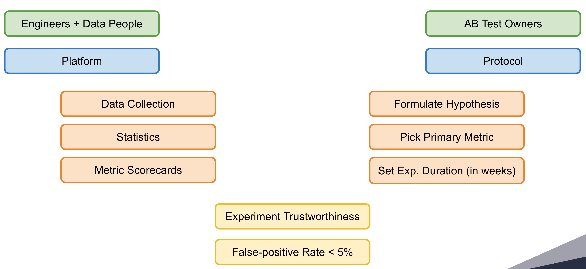

# Experimentation Protocol

We try to be well aware that implementation of experimentation protocol is what all of us experimenters will find the most difficult to understand and get done correctly when running experiments in teams and scaling the experimentation up to the whole companies.

The experimentation protocol we are implementing is here to rather enable us to safely run and evaluate more experiments than to limit us from expanding our experimentation.

Experimentation is a work with uncertainty where errors and erroneous decisions were and will be a necessary part of it. When experimenting on a larger scale, errors happen. It’s no longer a “small chance of error” in case when I am running one or two experiments. Errors happen with a specific chance. This chance must be monitored and controlled for.

It will always be true that we will be making wrong decisions based on experiment data. There is no way out of it. We can only control it. It is not about being statistically correct, it is that we can and should know that we are making the right decision 95 times and the wrong one 5 times out of every 100 decisions we make. Not knowing and controlling for this, we are playing a game where we do not know our odds of a good or a bad decision.

> Only by joint effort among systems, data, and experimenters, we can guarantee to keep  erroneous decisions at bay.

Decisions we make are the most important outcome from experimenting, we need to keep bad decisions at bay. To do that, we need to set experiment duration upfront and follow the experimentation protocol. Following experimentation protocol is not special to us, it is a proven concept from clinical trials and also from online controlled experiments, it ensures that we are making the right decisions most of the time.

Setting experiment duration upfront is certainly the most difficult point. We are not sure if current implementation (still in development) is the best one, we will need to iterate based on your feedback. We will have a calculator that helps to set duration almost in a conversational manner. In future iterations, we can run automated pre-tests to determine audience sizes and baseline conversion rates, we can improve the statistics, we can make it a lot easier and relax experimenters from filling up what we have to do today.

There is one more immediate benefit from setting the duration upfront, we are able to stop experiments early much before the set duration if results are good (or bad) enough. And we can do early stopping safely with again keeping errors at bay below 5%. I personally believe that this possibility of early stopping without introduction of further error into our decision making is worth it.

## Experimentation Protocol in Depth

General aim of experimenting is to test a new idea (feature) on a fraction of users. Based on observed behavior of users exposed to the experiment, we want to infer what will happen if we full-scale the change to the whole user base. We are looking for the best option as well as we are limiting a risk of full-scaling harmful ideas (features). The experimenting is a work with uncertainty and thus it includes inevitable errors.

We distinguish two types of errors in experimenting:

1. Type I error (False-positive error)
    * We DO detect falsely significant result as significant
    * Null hypothesis is true and we reject it
2. Type II error (False-negative error)
    * We DO NOT detect truly significant result as significant
    * Null hypothesis is false and we do not reject it

The Experimentation Platform keeps false-positive errors below 5% by

1. Implementation of sound statistical evaluation (engineers and data people).
1. Asking experimenters to (dully) follow *Experimentation Protocol*.

By ignoring Experimentation Protocol you can drastically increase false-positive errors (even multiple times) making results of the experiment highly misleading! There should not be done any business decision based on such results.

When implementing the experimentation protocol, we followed a meta-study [Three Key Checklists and Remedies for Trustworthy Analysis of Online Controlled Experiments at Scale](https://www.researchgate.net/publication/333614384_Three_Key_Checklists_and_Remedies_for_Trustworthy_Analysis_of_Online_Controlled_Experiments_at_Scale) that collects best-practices from the leading experimentation platforms in Booking.com, Microsoft, Intuit and others. We also studied how online platforms like Optimizely, Google Optimize, VWO, AB Smartly implement experimentation protocols to come up with the meaningful yet powerful minimum.

The experimentation protocol requires the experimenter to adhere to following steps:

1. Formulate Hypothesis
1. Pick Primary Metric
1. Set Experiment Duration
1. Check Guardrail Metrics

## Formulate Hypothesis

Experiment hypothesis should be defined and should be falsifiable. Experiment analysis begins with the transformation of an idea for testing into an experiment. The first step in this process is the impact analysis. Every change for testing should be introduced with a description of what the change that will be evaluated is, who will see the change, what the expected impact is, and how this impact is connected to the top-level business goals (increase in revenue). Most importantly, an impact analysis should contain a line of reasoning – belief - that explains why a change is expected to have an impact. Common questions that help in evaluating this item are “Why are we improving this?”, “Why is existing state not good enough?”, “Why will the change make a difference?”, “Will it help the users, the business, or both?”[^1]

## Pick Primary Metric

Picking primary metric helps to frame the experiment by determining what is the most important to measure. It also helps to think about possible next steps after the experiment will be over. Think about what you will do in all 3 possible experiment results:

1. Significant positive impact
1. Significant negative impact
1. Inconclusive results

## Set Experiment Duration Before Starting It

The length of the experiment must be set upfront (before starting the experiment). If we do not set it up, then when should we stop? Immediately when the difference in the primary metric is significant? Or should we wait two more days and stop it then?

Imagine you are developing a new version of a drug (medicament) and now you want to test a new version versus an old version. How will you proceed? Probably you will select a group of people and test it on them. If the difference between old and new versions is not statistically significant in a selected group of people, you end up experimenting with the result that the new drug is not outperforming the old one. But definitely you will not be adding more and more people to the experiment just to prove the new one is better. The same holds for online experiments.

The experimenter must estimate the necessary duration of the experiment carefully. The best way to do it is to use the Sample Size Calculator implemented right in the Experimentation Platform, or ask colleagues, or ping EP Support team.

The Experimentation Platform supports safe *early-stopping* of the experiment. If the experiment is performing really great or really poor, we can stop it right now and make a decision. We do not need to wait until the end of the experiment. For the right and safe set up of early-stopping criteria, we need experimenters to set up the appropriate duration of the experiment upfront. This is alpha and omega of controlling false-positive errors - falsely claiming untrue effect to be a true effect.

See [Sequential Analysis](../stats/sequential.md) for detailed explanation.

## Check Guardrail Metrics

Many things can go wrong during the experiment running phase. We might not get IID exposures in variants, data pipelines could fail, there could be client-side bugs in the experiment implementation. It is necessary to check for possible bugs before evaluating the experiment.

While EP is not a platform to check all possible errors, it does the best to highlight and warn about them. EP does *Sample Ratio Mismatch* check for all experiments by default and it offers several guardrail metrics that could be part of the secondary metric definition.

### Sample Ratio Mismatch

Checking for SRM-Sample Ratio Mismatch, is an important test everyone doing experimenting should do. If you designed your experiment with equal percentages and got 821,588 vs. 815,482 users (50.2% instead of 50%), stop and find the bug[^2].

Failing SRM check tells us there is some underlying problem in the experiment randomization. Experiments with failed SRM check should not be evaluated at all.

See [SRM](../stats/basics.md#sample_ratio_mismatch) for details about EP implementation.

## Pros and Cons

On one hand we require experimenters to set experiment duration upfront, on the other hand we allow for safely calling the experiment off any time when measured differences are big enough.

[^1]: [Three Key Checklists and Remedies for Trustworthy Analysis of Online Controlled Experiments at Scale](https://www.researchgate.net/publication/333614384_Three_Key_Checklists_and_Remedies_for_Trustworthy_Analysis_of_Online_Controlled_Experiments_at_Scale)
[^2]: [R. Kohavi, Sample Ratio Mismatch](https://twitter.com/ronnyk/status/932798952679776256)
